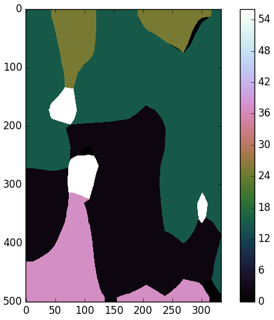

# Evaluate PASCAL VOC 2010 images on FCN-32s
This guides walks you through the steps required to evaluate PASCAL VOC 2010 images on the FCN-32s Fully Convolutional Network for Semantic Segmentation. The steps include downloading the model difinitions for FCN-32s, the pre-trained caffe-model and PASCAL VOC2010 dataset as well as some minor modification to the python script used for evaluating the network.

## Guide
1. Download the Caffe network definitions from github
  1. Go to [https://gist.github.com/shelhamer/80667189b218ad570e82#file-readme-md](https://gist.github.com/shelhamer/80667189b218ad570e82#file-readme-md)
  1. Select “Download ZIP”
  1. In the File Explorer in Ubutuntu, go to ~/code/caffe/models and create a folder called fcn_32_pascal_contex
  1. Extract the content of the ZIP to this folder
1. Download the pre-trained model
  1. Download link: [http://dl.caffe.berkeleyvision.org/fcn-32s-pascalcontext.caffemodel](http://dl.caffe.berkeleyvision.org/fcn-32s-pascalcontext.caffemodel)
  1. Place file in ~/code/caffe/models/fcn_32_pascal_contex
1. Download the VOC2010 dataset
  1. Download the Training/Validation set from the Development Kit section of the Pascal VOC2010 webpage: [http://host.robots.ox.ac.uk/pascal/VOC/voc2010/#devkit](http://host.robots.ox.ac.uk/pascal/VOC/voc2010/#devkit)
  1. Unzip the content to ~/code/caffe/models/pascal/VOC2010/
   1. **Note:** The VOC2010 folder should contain 5 folders named “Annotations”, “ImageSets”, “JPEGImages”, “SegmentationClass” and “SegmentationObject”. However, in this guide we will only be using the JPEGImages folder.
1. Download the class labels
  1. Download link: [http://www.cs.stanford.edu/~roozbeh/pascal-context/59_labels.txt](http://www.cs.stanford.edu/~roozbeh/pascal-context/59_labels.txt)
  1. **Note: ** These are only needed for your own reference.
1. Modify eval.py to show the output from the network
  1. Open a Terminal window (Ctrl+alt+T)
  2. Go to the folder with the FCN32 model:
  ```
  cd $CAFFE_ROOT/models/fcn_32_pascal_contex
  ```
  3. Open eval.py in gedit:
  ```
  gedit eval.py
  ```
  4. In the top of the document add:
  ```python
  from skimage import io
  ```
  5. In end of the document add:
  ```python
  io.imshow(out)
  io.show()
  ```
  6. Save and close the document.
1. Run the test example
  1. Open a Terminal window (Ctrl+Alt+T)
  2. Run evaluate the test image on the network:
  ```
  ipython eval.py
  ```
  3. When the image has been evaluated, the highest scoring class for each pixel will be displayed as an image.
  4. Place the mouse over a pixel to read its label ID in the lower left corner, and use the class labels from step 4 to translate it into a class.
  5. You should see something like right image below.




**Left**: original image (2007_000129.jpg). **Right**: evaluated image. Black (2) = Bicycle. Dark green (15) = person. Light green (25) = building. Pink (37) = ground. White (56) = wall.

----------