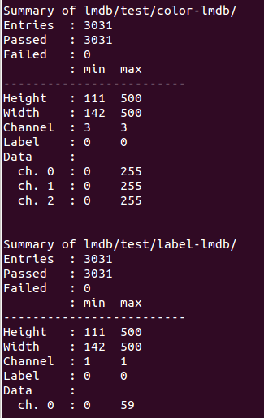

# Fine-tune FCN-32s on PASCAL-Context dataset *(WORK IN PROGRESS)*
This guide provides step-by-step instructions for fine-tuning the Caffe model provided by Jonathan Long et al. using the PASCAL-Contex dataset.

## Guide
1. Download the Pascal-context annotations ***(incorrect information. Needs to be updated!)***
    1. Go to: http://www.cs.stanford.edu/~roozbeh/pascal-context/#download
    1. Download “59_context_labels.tar.gz”
        1. This should contain the labels for the  Pascal-Context training set. These are stored as *.png-files where the intensity corresponds to the class.
    1. Untar the container into: $CAFFE_ROOT/models/fcn_32_pascal_contex/pascal/VOC2010/59_context_labels/
    1. Create two new folders called 59_context_labels (test) and 59_context_labels (train) in the pascal VOC2010 folder; $CAFFE_ROOT/models/fcn_32_pascal_contex/pascal/VOC2010/
    1. Copy half the images from 59_context_labels into 59_context_labels (train) and the other half into 59_context_labels (test)
        * **Note:** The content of these two folders will determine your training and test set.
        * **Note:** A separate test set is available here, but it requires you to setup an account (However, it can be done fairly quickly, if you are interested).
1. Create LMDB databases for input data and labels for both training and test set
    1. Download createLMDB.py and checkLMDB.py and save them in $CAFFE_ROOT/models/fcn_32_pascal_contex/
    1. Open createLMDB.py and modify the variables “color_dir”, “label_dir” and “output_dir” to match your folder structure for your training set.
        * If you have followed the folder naming convention of this guide, the following variables should work for the train set:
        
            ```
            color_dir = './pascal/VOC2010/JPEGImages'
            label_dir = './pascal/VOC2010/59_context_labels (train)'
            output_dir = './lmdb/train/'
            ```
            
        * And for the test set:
        
            ```
            color_dir = './pascal/VOC2010/JPEGImages'
            label_dir = './pascal/VOC2010/59_context_labels (test)'
            output_dir = './lmdb/test/'
            ```
            
    1. Save and close createLMDB.py
    1. Open a terminal window (Ctrl+Alt+T) and type:
        ```
        cd $CAFFE_ROOT/models/fcn_32_pascal_contex/
        ```
        
    1. Create the LMDB by typing
        ```
        ipython createLMDB.py
        ```
        
        * This will create both the input data and label LMDB for your training set.
        * When the LMDBs have been created, the script will output some statistics (as seen below) as well as save the mean intensity values for input images.

        * **Note:** If you run the script twice with the same output_dir, the LMDB in the corresponding folders will NOT be overwritten but instead the new data will be appended to the existing LMDB!

    1. Repeat step b-e for your test set.
    1. Check that the LMDBs are ok by typing:
        ```
        ipython checkLMDB.py lmdb/train/color-lmdb/ lmdb/train/label-lmdb/ lmdb/test/color-lmdb/ lmdb/test/label-lmdb/
        ```

        * The output should look something like this (only results for training set is shown):
        
            
            

        * **Note:** The number of entries in each input data (color-lmdb) and labels (label-lmdb) should be the same. Verify that the number of channels in the input data and the labels are as expected. Same goes for their min and max height, width, label and data channel intensities (ch. 0 etc.). For semantic segmentation, the labels should all be 0.
        
1. Modify train_val.prototxt
    1. In the terminal type the following to edit train_val.prototxt

        ```
        gedit train_val.prototxt
        ```

    1. Modify the “data”-layer during the TRAIN phase:
        1. Set the mean_values according to the values stored in $CAFFE_ROOT/models/fcn_32_pascal_contex/lmdb/train/color-mean.csv
        1. Set the source for the data_param:
        
            ```
            source: "./lmdb/train/color-lmdb/"
            ```
            
    1. Modify the “label”-layer during the TRAIN phase:
        1. Set the source for the data_param:
        
            ```
            source: "./lmdb/train/label-lmdb/"
            ```
            
    1. Modify the “data”-layer during the TEST phase:
        1. Set the mean_values according to the values stored in $CAFFE_ROOT/models/fcn_32_pascal_contex/lmdb/test/color-mean.csv
        1. Set the source for the data_param:
        
            ```
            source: "./lmdb/test/color-lmdb/"
            ```
        
    1. Modify the “label”-layer during the TEST phase:
        1. Set the source for the data_param:
        
            ```
            source: "./lmdb/test/label-lmdb/"
            ```

1. Use caffemodel as a stating point
1. Modify solver.prototxt
    1. Set display = 1
    1. Set test_iter equal to the number of images in your test set
1. Run solve.py
    Note: If out of memory, consider using the cpu instead. Change caffe.set_mode_gpu() to caffe.set_mode_cpu()
    

## Problem solving
* Out of memory error:
    * Although you might be able to evaluate an image using the GPU, training the network requires significantly more memory. Hence, you might run into an error similar to this:
        ```
        I0202 10:18:18.001775  3173 net.cpp:299] Memory required for data: 948953956
        I0202 10:18:18.001890  3173 solver.cpp:65] Solver scaffolding done.
        [libprotobuf WARNING google/protobuf/io/coded_stream.cc:505] Reading dangerously large protocol message.  If the message turns out to be larger than 2147483647 bytes, parsing will be halted for security reasons.  To increase the limit (or to disable these warnings), see CodedInputStream::SetTotalBytesLimit() in google/protobuf/io/coded_stream.h.
        [libprotobuf WARNING google/protobuf/io/coded_stream.cc:78] The total number of bytes read was 597011289
        F0202 10:18:19.439698  3173 syncedmem.cpp:58] Check failed: error == cudaSuccess (2 vs. 0)  out of memory
        *** Check failure stack trace: ***
        Aborted (core dumped)
        ```
    
    * The solution is to set make the solver use the CPU instead of the GPU.
        1. In a terminal window, write
            ```
            gedit solve.py
            ```
        
        1. Go to the line with “caffe.set_mode_gpu()” and replace it with “caffe.set_mode_cpu()”
        1. Save and close solve.py
        1. Run solve.py again from the terminal
            ```
            ipython solve.py
            ```
        
    * **Note:** Training on the CPU will take longer than on the GPU. 
    * **Note:** If you are using your own data, reducing the image size will also reduce the required memory.
